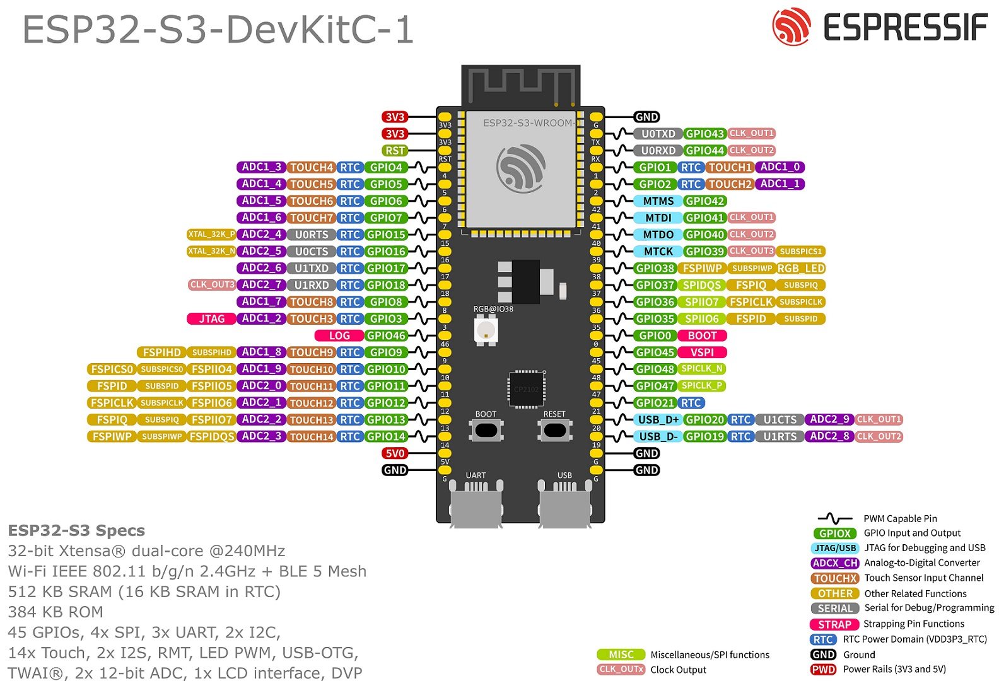
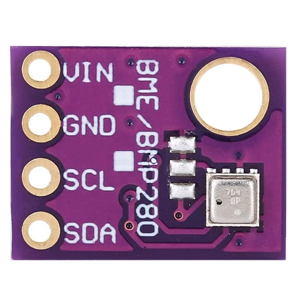
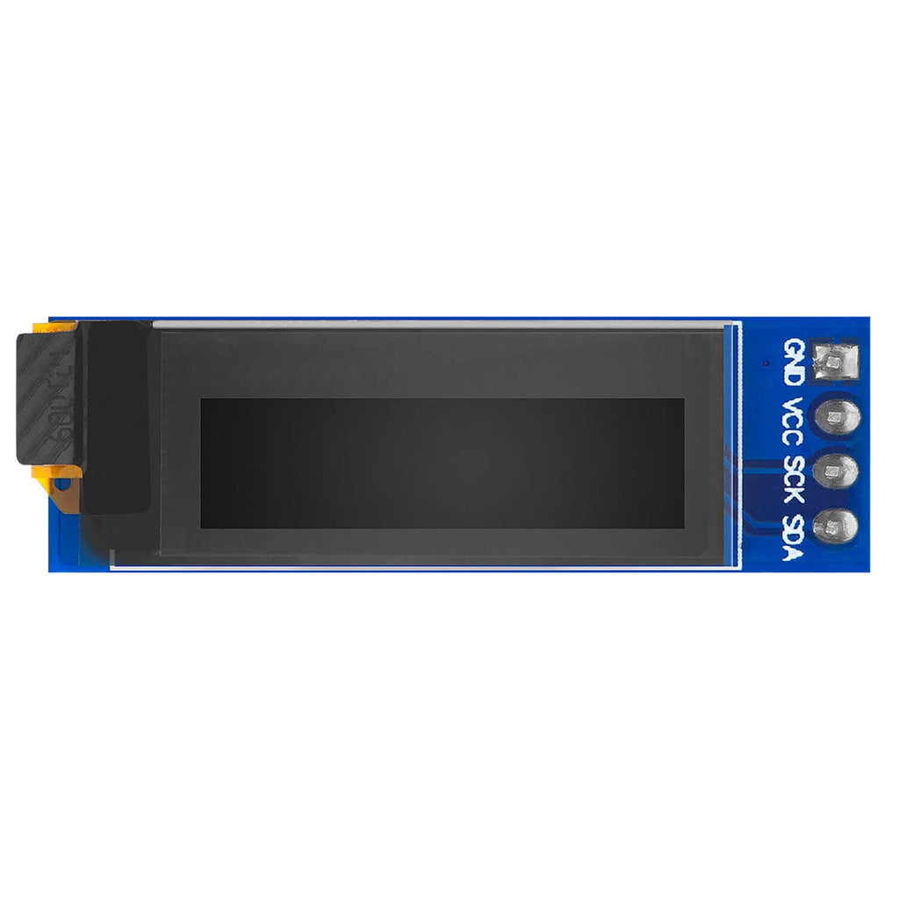
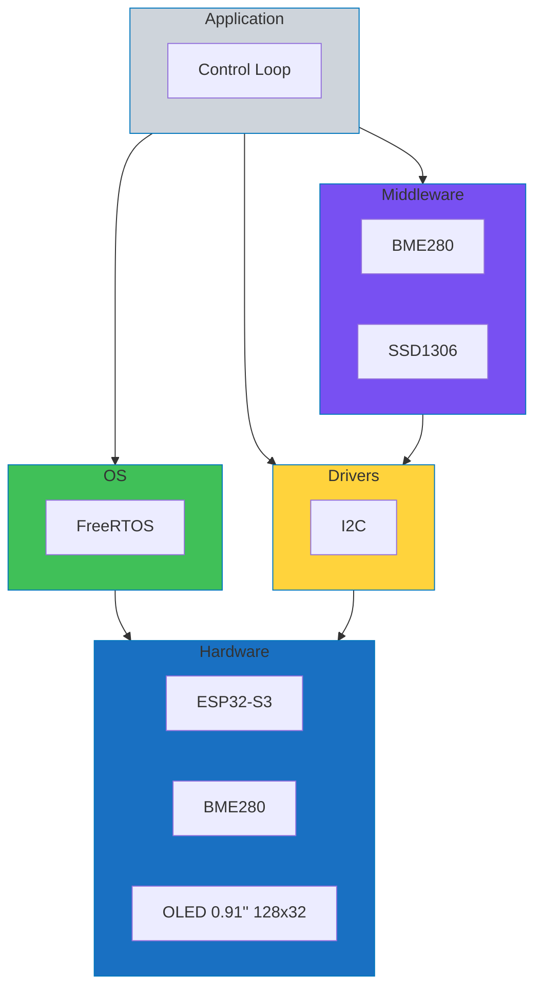
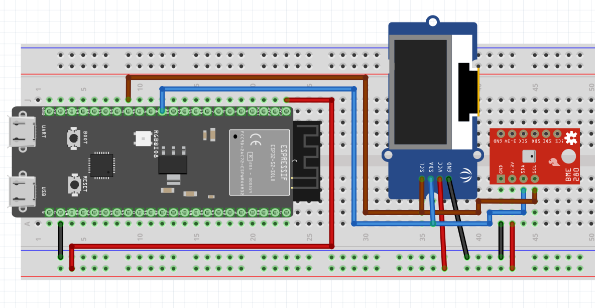
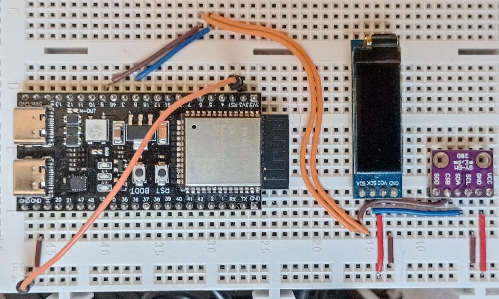
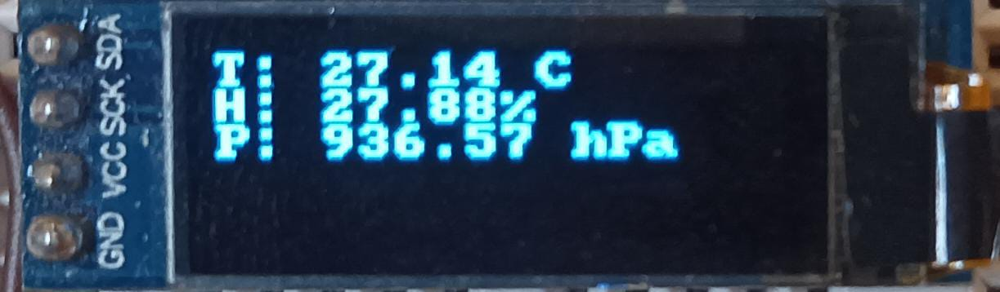
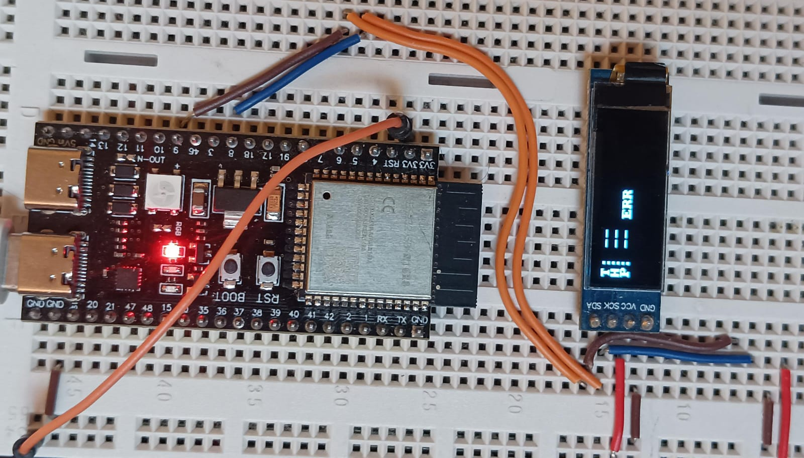
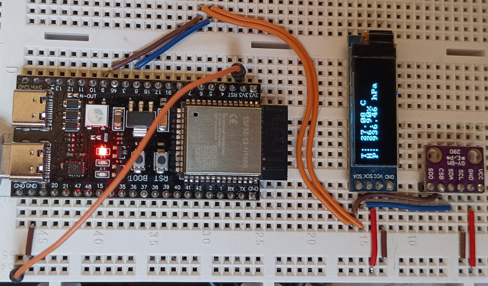

# Room Environment Monitor
[](https://github.com/Embedded-Systems-Hub/Room-Environment-Monitor/actions)

This project demonstrates an ESP32-S3 application built with ESP-IDF that monitors room temperature, humidity and pressure using a BME280 sensor. It displays live values on a 0.91" 128×32 OLED.

---

## High-level Requirements

| ID | Type | Requirement | Acceptance |
|----|------|-------------|------------|
| R1 | Functional | Read temperature, humidity and pressure from BME280 every 1 s | Stable values returned ≥ 30 min without read errors |
| R2 | Functional | Render live values on 0.91" 128x32 OLED with clear layout | Screen updates ≤ 1 s after each sample, text readable at 50 cm |
| R3 | Functional | Indicate sensor or display faults gracefully | On error, show placeholder or icon and auto retry without reboot |
| R4 | Non-functional | Target ESP32-S3 using ESP-IDF only | Project builds clean on ESP-IDF (no critical warnings) |
| R5 | Non-functional | Timing budget respected | Sampling 1 s ±10%, no visible UI stutter |
| R6 | Non-functional | Integration tests | Tests cover success and error paths |

---

## Hardware and Software

### Hardware
- ESP32-S3-DevKitC-1 (ESP32-S3-WROOM-1-N16R8)



- BME280 (Bosch)



- OLED 0.91" 128×32 (SSD1306 controller)



### Software
- ESP-IDF v5.4.1
- Drivers/Libraries: ESP-IDF I2C master, SSD1306 driver, BME280 driver, FreeRTOS for delay.

---

## Architecture Overview



---

## System Configuration
### Interfaces
- I²C bus used for both BME280 and OLED (SSD1306)
- I²C address BME280: 0x76
- I²C address OLED: 0x3C
- I²C speed: 100 kHz

### Pin Assignments (ESP32-S3)
| Signal | GPIO   | Connected To         | Notes         |
| ------ | ------ | -------------------- | ------------- |
| SDA    | GPIO 8 | BME280 SDA, OLED SDA | I²C data      |
| SCL    | GPIO 9 | BME280 SCL, OLED SCL | I²C clock     |
| 3V3    | 3.3 V  | VCC (BME280 + OLED)  | Power supply  |
| GND    | GND    | GND (BME280 + OLED)  | Common ground |

### Wiring Diagram



### Hardware Setup

All components connected as defined in the wiring table above.



---

## Build and Flash Instructions

### Environment Setup
Project built and flashed using the **ESP-IDF VS Code Extension** with ESP-IDF **v5.4.1**.

### Build & Flash
From the VS Code ESP-IDF terminal:  
```bash
    idf.py set-target esp32s3
    idf.py build
    idf.py flash monitor
```

### External Dependencies
```bash
dependencies:
  k0i05/esp_ssd1306: ^1.2.7
  espressif/bme280: =*
```

---

## Implementation Overview

The firmware periodically reads temperature, humidity and pressure values from the BME280 sensor and updates the OLED display in real time.

Data flow:
1. **BME280 driver** acquires raw sensor readings via I²C.
2. **Control loop task** sanitizes and formats the readings into text strings.
3. **SSD1306 display driver** renders three lines (Temperature, Humidity, Pressure) on the 128×32 OLED.
4. Display refreshes every 1 s with the latest values.

---

## Results

### Display Output

- Nominal



- Error



### Functional Testing

| Test ID | Feature | Procedure | Expected Result | Status |
|----------|----------|------------|------------------|---------|
| T1 | Sensor reading | Observe serial logs and OLED output | Stable temperature, humidity and pressure values update every 1 s | ✅ Pass |
| T2 | Display update | Verify screen refresh timing and layout | Values update within 1 s, text readable and aligned | ✅ Pass |
| T3 | Error handling | Disconnect BME280 temporarily | Display shows placeholder/error icon and system retries automatically | ✅ Pass |
| T4 | System stability | Run continuously for 30 minutes | No read or display errors, stable operation | ✅ Pass |



### Stress and Reliability Testing

The system was operated continuously for **12 hours** with periodic sensor reads every 1 s.

**Observations:**
- No crashes, watchdog resets, or I²C communication errors detected.
- Sensor readings remained stable within expected ranges.
- OLED display updated consistently with no visible artifacts or freezes.

**Result:**

✅ System demonstrated stable and reliable operation over extended runtime.

### Final System Performance

**Performance Metrics:**
- Sampling rate: 1.00 s ± 5 ms (measured over 100 cycles)
- OLED update latency: < 200 ms after new data acquisition
- Sensor accuracy: within ±0.5 °C, ±3 % RH, ±1 hPa compared to reference
- CPU load: < 10 % at 240 MHz core clock
- Uptime: > 12 h continuous operation without faults

**Conclusion:**

✅ System meets all performance, accuracy, and reliability expectations.

---

## 🔗 Useful Links

| Resource | Description |
|-----------|-------------|
| [Embedded Systems Hub](https://www.skool.com/embedded-systems-hub/about) | Embedded Systems Hub |
| [ESP32-S3 User Guide](https://docs.espressif.com/projects/esp-dev-kits/en/latest/esp32s3/esp32-s3-devkitc-1/index.html) | User Guide of the ESP32-S3-DevKitC-1 |
| [BME280](https://www.bosch-sensortec.com/media/boschsensortec/downloads/datasheets/bst-bme280-ds002.pdf) | BME280 datasheet |
| [SSD1306](https://cdn-shop.adafruit.com/datasheets/SSD1306.pdf) | SSD1306 datasheet |
| [OLED](https://protosupplies.com/product/oled-0-91-128x32-i2c-white-display) | OLED 0.91″ 128×32 |
| [ESP-IDF I2C](https://docs.espressif.com/projects/esp-idf/en/stable/esp32/api-reference/peripherals/i2c.html) | ESP-IDF Inter-Integrated Circuit (I2C) |
| [LICENSE](https://github.com/Embedded-Systems-Hub/Room-Environment-Monitor/blob/HEAD/LICENSE) | License of this project |
